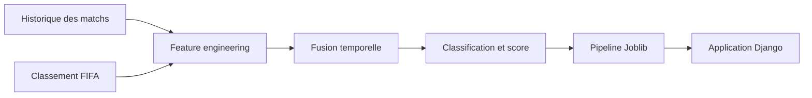

# World Cup Intelligence

Projet d'examen de Machine Learning consacré à la prédiction des résultats de matchs internationaux de football.

## Pipeline



## Fichiers principaux

- `notebooks/01_feature_engineering.ipynb` : préparation et fusion des données ;
- `notebooks/02_modelisation.ipynb` : comparaison, optimisation et sauvegarde des modèles ;
- `app/predictor/services.py` : construction des features et prédiction dans Django ;
- `reports/rapport_projet.md` : rapport académique complet.

## Lancement

```powershell
.\.venv\Scripts\Activate.ps1
cd app
python manage.py migrate
python manage.py tailwind runserver
```

Ouvrir `http://127.0.0.1:8000/`.

## Résultat principal

Le modèle retenu est une régression logistique optimisée : accuracy de 58,32 %, macro F1 de 52,47 % et log-loss de 0,8880 sur un test chronologique.

Consulter [`reports/rapport_projet.md`](reports/rapport_projet.md) pour la méthodologie, les performances et les limites.
