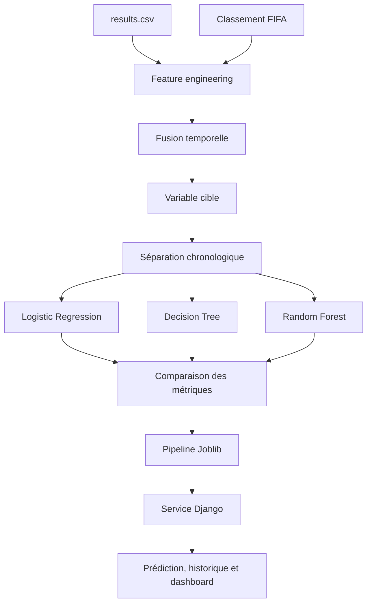

# Rapport du projet de Machine Learning

## Prédiction des résultats de matchs internationaux de football

**Projet :** Examen de Machine Learning  
**Application :** World Cup Intelligence  
**Approche :** feature engineering temporel, classification multiclasse, régression de Poisson et application Django  
**Date du rapport :** 11 juillet 2026

---

## 1. Résumé

Ce projet cherche à prédire l'issue d'un match international de football à partir de deux sources : l'historique des matchs et le classement FIFA. Pour chaque rencontre, les données disponibles avant le match sont utilisées afin d'éviter toute fuite d'information.

Le jeu final contient **30 782 matchs** et **34 variables prédictives**. Trois modèles étudiés en cours ont été comparés avec une séparation chronologique : régression logistique, arbre de décision et forêt aléatoire. La **régression logistique optimisée** a été retenue. Elle obtient une accuracy de **57,88 %**, un F1-score pondéré de **56,42 %**, un macro F1 de **51,32 %** et une log-loss de **0,8962**.

Deux régressions de Poisson complémentaires estiment les buts des équipes A et B. Enfin, les pipelines ont été intégrées à une application Django qui calcule automatiquement les features, affiche les probabilités et un score probable, puis sauvegarde les prédictions dans SQLite.

---

## 2. Questions traitées

Le projet répond aux objectifs suivants :

1. réaliser le feature engineering de l'historique des matchs ;
2. préparer le classement FIFA ;
3. fusionner les deux bases en respectant les équipes et les dates ;
4. construire une cible multiclasse ;
5. tester trois modèles et déployer le meilleur ;
6. permettre la création de scénarios de matchs futurs et l'analyse des favoris.

---

## 3. Organisation finale du projet

```text
Examen/
├── data/
│   ├── raw/
│   │   ├── results.csv
│   │   └── fifa_ranking-2024-06-20.csv
│   └── processed/
│       └── modeling_data.csv
├── notebooks/
│   ├── 01_feature_engineering.ipynb
│   └── 02_modelisation.ipynb
├── app/
│   ├── config/
│   ├── predictor/
│   ├── dashboard/
│   ├── ml_model/
│   ├── templates/
│   ├── theme/
│   ├── db.sqlite3
│   └── manage.py
├── reports/
│   └── rapport_projet.md
├── requirements.txt
└── README.md
```

L'organisation suit une logique simple proche du cours :



Toute la logique utilisée par Django se trouve désormais dans `app/predictor/services.py`. Le dossier intermédiaire `src` a été supprimé pour rendre l'approche plus directe et pédagogique.

---

## 4. Analyse de l'historique des matchs

### 4.1 Description

| Élément | Résultat |
|---|---:|
| Nombre de lignes | 49 499 |
| Nombre de colonnes | 9 |
| Première date | 30 novembre 1872 |
| Dernière date | 6 juillet 2026 |
| Compétitions différentes | 200 |
| Matchs de Coupe du monde | 1 058 |
| Matchs sur terrain neutre | 26,54 % |
| Matchs sans score | 9 |
| Doublons exacts | 0 |

La base ne contient pas uniquement la Coupe du monde. Elle regroupe des matchs amicaux, des qualifications, des compétitions continentales et d'autres matchs internationaux. Tous ces matchs sont utiles pour mesurer la forme récente des sélections. La variable `tournament` permet au modèle de distinguer le contexte de la rencontre.

Les neuf lignes sans score ne participent ni au calcul de la forme ni à l'entraînement.

### 4.2 Transformation équipe-match

Chaque rencontre est transformée en deux observations temporaires :

- une ligne du point de vue de l'équipe à domicile ;
- une ligne du point de vue de l'équipe à l'extérieur.

Cette transformation permet de calculer l'historique propre à chaque équipe avant de revenir à une ligne par match.

### 4.3 Variables de forme

Les variables suivantes sont calculées sur les cinq matchs précédents :

- nombre de matchs disponibles ;
- victoires, matchs nuls et défaites ;
- moyenne des buts marqués ;
- moyenne des buts encaissés ;
- points de forme, avec trois points par victoire et un point par nul ;
- différences entre l'équipe A et l'équipe B.

La méthode utilise `shift(1)` avant la fenêtre glissante. Le match actuel ne peut donc jamais contribuer à ses propres variables.

---

## 5. Analyse du classement FIFA

| Élément | Résultat |
|---|---:|
| Nombre de lignes | 67 472 |
| Nombre de colonnes | 8 |
| Première publication | 31 décembre 1992 |
| Dernière publication | 20 juin 2024 |
| Pays ou entités | 216 |
| Rangs manquants | 9 |
| Doublons équipe-date | 0 |

Les variables FIFA conservées sont :

- rang ;
- total de points ;
- variation du rang ;
- confédération ;
- date du classement.

Les noms différents entre les deux sources sont corrigés avec une table explicite. Exemples : `United States → USA`, `South Korea → Korea Republic`, `Ivory Coast → Côte d'Ivoire` et `Cape Verde → Cabo Verde`. Aucun rapprochement approximatif automatique n'est utilisé.

---

## 6. Fusion temporelle

La fusion utilise `pandas.merge_asof` avec une recherche vers le passé. Pour chaque équipe, le dernier classement disponible à la date du match est sélectionné.

La condition respectée est :

```text
rank_date <= match_date
```

Deux fusions sont réalisées, une pour l'équipe A et une pour l'équipe B. Des assertions vérifient que :

- le nombre de matchs ne change pas ;
- `match_id` reste unique ;
- aucune date de classement future n'est utilisée.

La couverture depuis le début du classement FIFA atteint **94,99 %** pour l'équipe A et **94,56 %** pour l'équipe B. Les sélections non affiliées à la FIFA restent volontairement sans classement.

Les variables finales incluent notamment : `home_rank`, `away_rank`, `home_total_points`, `away_total_points`, `rank_diff`, `total_points_diff` et l'ancienneté du classement en jours.

---

## 7. Variable cible

La cible est construite uniquement avec les scores :

| Code | Classe | Effectif | Proportion |
|---:|---|---:|---:|
| 0 | Victoire équipe A / domicile | 14 948 | 48,56 % |
| 1 | Match nul | 7 179 | 23,32 % |
| 2 | Victoire équipe B / extérieur | 8 655 | 28,12 % |

La classe des matchs nuls est minoritaire. Ce déséquilibre explique pourquoi l'accuracy seule ne suffit pas pour choisir le modèle.

### Contrôle des fuites de données

| Information | Utilisée comme feature ? | Justification |
|---|---|---|
| Score final A | Non | Disponible après le match |
| Score final B | Non | Disponible après le match |
| Cible | Non | Variable à prédire |
| Match actuel dans la forme | Non | Exclu avec `shift(1)` |
| Classement publié après le match | Non | Exclu par la fusion temporelle |
| Forme des cinq matchs antérieurs | Oui | Disponible avant le match |
| Dernier classement FIFA antérieur | Oui | Disponible avant le match |

---

## 8. Préparation pour la modélisation

Le jeu candidat contient **30 782 matchs**, de janvier 1993 à juillet 2026. Il comporte 48 colonnes techniques et descriptives, dont 34 sont réellement fournies aux pipelines.

Les matchs sont séparés chronologiquement :

- entraînement : 24 597 matchs, jusqu'au 18 novembre 2019 ;
- test : 6 185 matchs, à partir du 19 novembre 2019.

Aucune date n'est partagée entre les deux ensembles.

Les variables numériques sont imputées par la médiane. La régression logistique utilise `StandardScaler`. Les variables catégorielles sont imputées par la modalité la plus fréquente puis encodées avec `OneHotEncoder(handle_unknown="ignore")`. Les arbres ne reçoivent pas de normalisation numérique inutile.

---

## 9. Modèles comparés

Les trois modèles imposés par le cours sont :

1. `LogisticRegression` ;
2. `DecisionTreeClassifier` ;
3. `RandomForestClassifier`.

Pour l'arbre, les profondeurs 3, 5, 8, 12 et illimitée ont été comparées sur une validation chronologique interne. La profondeur 8 a été retenue.

La régression logistique a également été réglée sur la validation interne. Le réglage final utilise `C=0.5` et un poids de 1,6 pour la classe des matchs nuls.

### 9.1 Résultats sur le test chronologique

| Modèle | Accuracy | Precision pondérée | Recall pondéré | F1 pondéré | Macro F1 | Rappel des nuls | Log-loss |
|---|---:|---:|---:|---:|---:|---:|---:|
| Régression logistique optimisée | 57,88 % | 56,51 % | 57,88 % | 56,42 % | **51,32 %** | 26,72 % | **0,8962** |
| Arbre de décision | 52,16 % | 56,75 % | 52,16 % | 53,69 % | 50,14 % | **37,76 %** | 1,3797 |
| Forêt aléatoire | **58,71 %** | 54,41 % | **58,71 %** | 55,29 % | 49,30 % | 12,59 % | 0,9094 |

### 9.2 Surapprentissage

| Modèle | Macro F1 train | Macro F1 test | Diagnostic |
|---|---:|---:|---|
| Régression logistique | 50,62 % | 51,32 % | Pas de surapprentissage visible |
| Arbre de décision | 51,10 % | 50,14 % | Écart faible |
| Forêt aléatoire | 93,09 % | 49,30 % | Surapprentissage très important |

La forêt aléatoire possède la meilleure accuracy, mais elle reconnaît très mal les matchs nuls et surapprend fortement. L'arbre reconnaît davantage de nuls, mais ses probabilités sont moins fiables. La régression logistique offre le meilleur compromis entre équilibre des classes, qualité des probabilités, stabilité et interprétabilité.

### 9.3 Modèle retenu

La **régression logistique optimisée** est retenue avec les paramètres principaux suivants :

```text
C = 0.5
class_weight = {0: 1, 1: 1.6, 2: 1}
```

Son pipeline complet est sauvegardé dans :

```text
app/ml_model/world_cup_prediction_pipeline.pkl
```

---

## 10. Prédiction du score

Le classifieur prédit une issue, pas un score. Deux modèles supplémentaires `PoissonRegressor` ont donc été entraînés :

- un modèle pour les buts de l'équipe A ;
- un modèle pour les buts de l'équipe B.

| Cible | Alpha | MAE sur le test |
|---|---:|---:|
| Buts équipe A | 0,01 | 1,042 but |
| Buts équipe B | 0,10 | 0,838 but |

Le score affiché est le score de Poisson le plus probable parmi ceux compatibles avec l'issue du classifieur. Cette règle évite d'afficher une victoire d'une équipe accompagnée d'un score contradictoire.

Le score exact reste plus difficile à prédire que l'issue. Une MAE proche d'un but signifie qu'un écart d'environ un but par équipe est courant.

---

## 11. Application Django

L'application suit le flux suivant :

```text
ModelForm
→ validation des équipes et de la date
→ construction des 34 features
→ pipeline.predict et pipeline.predict_proba
→ modèles Poisson
→ sauvegarde SQLite
→ résultat, historique et dashboard
```

### Fonctionnalités

- choix des deux sélections avec noms français ;
- choix du type de compétition ;
- choix de la date et du terrain neutre ;
- calcul automatique de la forme et du classement FIFA ;
- affichage du pays favori ;
- affichage des trois probabilités ;
- estimation d'un score ;
- niveau de confiance ;
- historique filtrable ;
- dashboard avec indicateurs et équipes favorites ;
- messages explicites en cas de modèle absent, équipe inconnue ou classement indisponible.

Les pipelines incluent leur prétraitement. Django ne refait manuellement ni normalisation ni encodage.

---

## 12. Scénarios futurs

La page de prédiction permet de créer des confrontations hypothétiques en faisant varier :

- les équipes ;
- le type de compétition ;
- la date ;
- le terrain neutre.

Chaque simulation est sauvegardée. Le dashboard agrège ensuite les pays apparaissant le plus souvent comme favoris.

Le projet n'invente pas un calendrier officiel futur. En l'absence d'un tableau officiel fourni en entrée, les confrontations restent des scénarios définis par l'utilisateur. Une extension possible serait un notebook de simulation de tournoi acceptant un fichier de rencontres.

---

## 13. Limites

1. Le dernier classement FIFA fourni date du 20 juin 2024. Pour une date postérieure, l'application utilise ce dernier classement et affiche un avertissement.
2. Les résultats des matchs futurs ou récents absents de `results.csv` ne peuvent pas influencer la forme.
3. Les matchs nuls restent difficiles à reconnaître.
4. Un résultat individuel peut être faux même si les métriques globales sont correctes.
5. Le score exact est très incertain et doit être interprété comme un scénario probable.
6. Les sélections non classées par la FIFA ne peuvent pas être proposées normalement dans l'application.
7. Les clubs ne sont pas couverts par les données et ne doivent pas être ajoutés sans nouvel entraînement.

---

## 14. Reproductibilité

### Installation

Depuis la racine du projet :

```powershell
.\.venv\Scripts\Activate.ps1
pip install -r requirements.txt
```

### Ordre d'exécution des notebooks

1. `notebooks/01_feature_engineering.ipynb` ;
2. `notebooks/02_modelisation.ipynb`.

Le premier notebook produit `data/processed/modeling_data.csv`. Le second entraîne et sauvegarde directement les pipelines dans `app/ml_model/`.

### Lancement de l'application

```powershell
cd app
python manage.py migrate
python manage.py tailwind runserver
```

Adresse : `http://127.0.0.1:8000/`

---

## 15. Conclusion

Le projet met en place une chaîne complète de Data Science : exploration, feature engineering sans fuite, fusion temporelle, comparaison chronologique des modèles, optimisation raisonnable, sauvegarde des pipelines et déploiement Django.

La régression logistique optimisée est préférée à la forêt aléatoire malgré une accuracy légèrement inférieure, car elle offre un meilleur équilibre entre les classes, une meilleure log-loss et beaucoup moins de surapprentissage. Les modèles de Poisson ajoutent une estimation de score, mais celle-ci doit rester secondaire par rapport aux probabilités de résultat.

Le projet est adapté à une utilisation académique et démontre clairement les principales étapes d'un workflow de Machine Learning appliqué au football.
